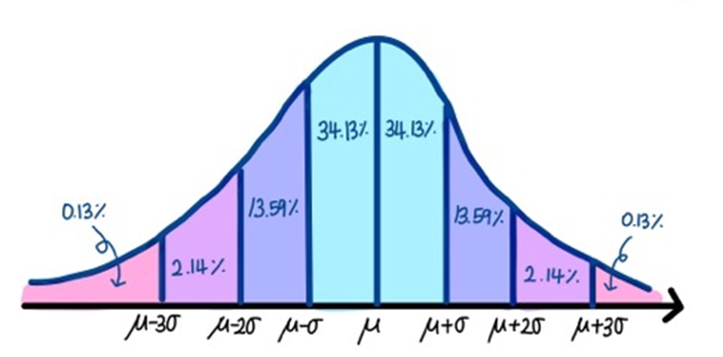
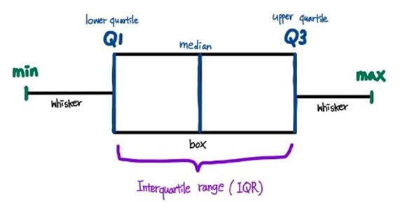
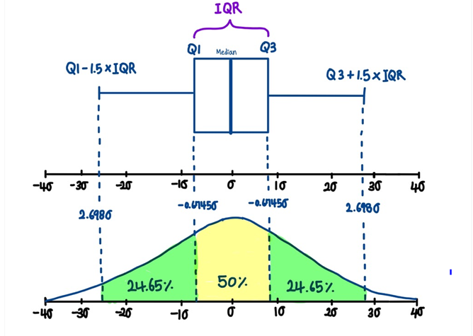
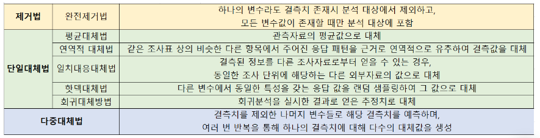

[toc]

# 1. EDA(Exploratory Data Analysis)

## 1. EDA 정의
탐색적 데이터 분석을 의미한다.
데이터 분석에 있어서 매우 중요한, 초기 분석 단계이다. 
데이터에 대한 일종의 견적을 내는 일이라고 비유할 수 있다. 
주어진 데이터의 특성을 알아야 내가 이 데이터로 해결하고자 하는 문젤르 해결할 수 있는 방법을 찾아볼 수 있기 때문이다. 
**데이터 분석하고 결과를 내는 과정에 있어 지속적으로 해당 데이터에 대한 탐색과 이해를 기본으로 가져야 한다.**

> EDA란

  주어진데이터(들)에서
  
    1. 시각화 같은 도구를 통해서 패턴을 발견한다..
    2. 데이터의 특이성을 확인한다.
    3. 통계와 그래픽 (혹은 시각적 표현)을 통해서 가설을 검정하는 과정 등을 하여 주어진 데이터에 대해 알아보는 것을 EDA라고 한다.

## 2. EDA 목적
**Goals of EDA**

1. 시각화 및 통계 도구를 사용하여 데이터를 이해할 수 있다.
2. 도출하고자 하는 결과의 기본이 되는 가정에 접근하고 가정을 검증할 수 있다.
3. 가설을 세우기 전에 데이터를 이해합니다.

데이터 수집 -> 데이터 전처리-> 순수 데잍터-> EDA(탐색적 데이터 분석)

EDA은 데이터를 다양한 관점에서 바라봄으로써, 다음과 같은 이점을 얻을 수 있습니다.

> 1. 데이터 잠재적인 문제 발견
> 2. 데이터의 다양한 패턴 발견
> 3. 자료수집을 위한 기반
> 4. 적절한 통계 도구 제시

데이터에 대한 이해와 탐색이 바탕외 되어야 문제를 발견 및 해결은 물론 데이터 분석을 하는 과정에서 필요한 통계도구, 자료수집 등을 결정하는데도 도움을 줍니다.

### 궁극적인 목적
develop intuition of our dataset and how it came into existence

## 3. EDA의 대상(타깃)
EDA의 대상은 다음과 같이 2가지가 있습니다.
- 일변량 (Univariate) : EDA를 통해 파악하려는 변수 1개
→ 데이터를 설명하고 패턴을 찾는 것이 목적

- 다변량 (Multi-variate) : EDA를 통해 파악하려는 변수 여러개
→ 변수들간의 관계를 보는 것이 목적

☝일변량의 경우

독립변수에 하나의 종속변수가 있는 것으로 일변량 분석은 어떤 대상의 성격을 규명하기 위하여 한가지 측면에서 그 대상을 관찰하고 분석하는 것에 유용합니다.

☝다변량의 경우

여러 개의 독립변수에 여러 개의 종속변수를 동시에 분석하는 것으로 다변량 분석은 여러 각도와 측면에서 변수들의 관계를 분석하는 것에 유용합니다.

#
## 4. EDA의 종류
EDA (탐색적 데이터 분석)의 종류도 다음과 같이 2가지가 있습니다.

시각화 (Graphic) : 차트, 그림 등을 이용하여 데이터를 확인하는 방법
→ 데이터를 한눈에 파악하여 대략적인 형태 파악 가능

비시각화 (Non-Graphic) : 그래픽적인 요소를 사용하지 않고, 주로 Summary Statistics으로 데이터 확인
→ 정확한 값을 파악하기 좋음

🧐 우리에게 익숙한 단어들이라 어렵지 않게 이해되시죠?

여기에서 Summary Statistics는 요약통계량으로
.describe() 함수를 사용하면 평균, 중앙값, 최대/최소값 등 데이터의 컬럼별 요약 통계량을 볼 수 있습니다.

그래서 비시각화의 경우, 시각적인 지표 없이도 요약통계량을 통해
대략적인 데이터의 분포를 유추하고 정확한 값을 파악하기 좋습니다❗

#

## 5. EDA의 유형
이제 EDA (탐색적 데이터 분석)의 유형에 대해서 알아보겠습니다.

EDA (탐색적 데이터 분석)의 유형은
EDA의 타켓과 종류를 하나씩 연결한 것으로, 총 4가지의 유형이 나옵니다.

1. 일변량 비시각화 (Uni-Non Graphic)
→ 데이터의 Distribution을 확인하는 것이 주목적

2. 일변량 시각화 (Uni-Graphic)
→ 데이터를 전체적으로 살펴보는 것이 주목적

3. 다변량 비시각화 (Muti-Non Graphic)
→ 주어진 둘 이상의 변수간 관계를 확인하는 것이 주목적

4. 다변량 시각화 (Muti-Graphic)
→ 주어진 둘 이상의 변수간 관계를 전체적으로 살펴보는 것이 주목적

#
## 6. EDA단계
1. 전체적인 데이터 분석
    - 분석의 목적과 목적에 맞는 변수가 무엇인지
    - 데이터형 확인/데이터의 오류나 누락이 없는지
    - 데이터를 구성하는 각 속성값이 예측한 범위와 분포를 갖는지 -> 아니라면 그 이유가 무엇인지 확인

2. 데이터의 개별 속성값 관찰
    - 개별 데이터를 관찰하며 전체적인 추세와 특이사항 관찰
    - 적절한 요약통계 지표 사영(평균, 중앙값, 분산 등)
    - 시각화를 통해 데이터의 개별 속성에 어떤 통계 지표가 적절한지 결정

3. 속성 간의 관계분석
    - 개별 속성 관찰에서 찾아내지 못했던 속성들의 조합, 패턴 발견
    - 그래프를 통해 시각화하여 속성 간의 관계 분석
    - 상관계수를 통한 상관관계 확인

🗣 간단히 말하자면,  

EDA는 데이터의 전체적인 부분을 파악하고 개별 속성값을 관찰한 후,
마지막으로 속성 간의 관계를 분석해보며 데이터를 탐색적으로 분석해보는 과정을 갖습니다.

# 2. 통계치 분석

## 1. 이상치

다음은 통계치 분석에서 이상치에 대해 알아볼까요?
이상치는 관측된 데이터의 범위에서 많이 벗어난 아주 작은 값이나 큰 값을 말하는데요,

'아주 작은' 값이나 '큰' 값이라는 것은 대체 어떤 기준에 의해 정해지는 걸까요?
다양한 이상치의 기준을 정하는 방법 중 2가지를 설명해드리도록 하겠습니다.

👤 첫 번째, 표준편차 (Standard Deviation)

우리가 잘 알고 있는 표준편차를 활용해 이상치를 탐지하는 방법입니다.
데이터의 분포가 정규 분포를 이룰 때, 표준편차 범위를 벗어나면 이상치로 간주합니다.

👥 두 번째, IQR
IQR은 EDA(탐색적 데이터 분석)를 개발한 존 튜키가 만든 이상치 검출 방법으로,
정규분포를 이루지 않을 때 활용 가능한 방법입니다.

그럼, IQR이 무엇인지 같이 자세히 알아볼까요❓
아래 이미지의 박스 플롯에서 맨 왼쪽은 데이터의 최소값을,
맨 오른쪽은 데이터의 최대값을, 가운데는 중앙값을 나타냅니다.

Q1과 Q3은 데이터를 4등분 했을 때의 범위로 Q1은 최소값을 포함한 하위 25% 범위를,
Q3은 최대값을 포함한 상위 25%의 범위를 나타냅니다. 이때, IQR의 값은 Q3에서 Q1을 뺀 값을 말합니다.

여기서 (Q1 - 1.5 * IQR)보다 작거나 (Q3 + 1.5 * IQR)보다 큰 데이터를 이상치로 처리합니다.
보통 1.5와 3을 사용하지만 그 이상의 값을 곱하기도 하며, 값이 클수록 더욱 최극단의 이상치를 처리할 수 있습니다.

## 2. 결측치

다음은 통계치 분석에서 결측치에 대해 알려드리도록 하겠습니다.
결측치는 관측되어야 할 값을 얻지 못한 데이터로, 전처리 단계에서 적절한 값으로 처리가 필요합니다.

### [결측치 유형]

👉 결측치의 유형에는 완전 무작위 결측, 무작위 결측, 비무작위 결측이 있습니다.

완전 무작위 결측(MCAR) :
→ 결측치가 다른 변수들과 아무런 상관관계가 없는 경우

무작위 결측(MAR) :
→ 특정 변수와 관련되어 누락됐지만, 변수들의 상관관계를 알 수 없는 경우

비무작위 결측(NMAR) :
→ 누락된 변수의 값이 누락된 이유와 관련이 있는 경우

설명된 내용을 봐도 무슨 내용인지 어려우시죠? 😅

예를 들어 설명을 해드리자면,
성별을 통해 체중을 예측하는 모델을 구축하기 위해 설문조사를 한다고 가정했을 때,

📋 단순히 응답하지 않았거나 응답이 누락된 경우 → 완전 무작위 결측에 해당

📋 만약 다수의 여성이 체중을 설문조사에서 응답하지 않았다고 했을 때,
성별의 영향으로 체중에 대해 응답을 하지 않았지만 성별과 체중은 관련이 있기 때문에 → 무작위 결측에 해당

📋 만약 체중이 무거운 사람들이 자신의 체중을 설문조사에 응답하지 않았다고 했을 때,
체중에 대한 응답이 누락된 것이 체중 자체에 영향을 받았기 때문에 → 비무작위 결측에 해당

### [결측치 처리 방법]

다음은 결측치를 처리하는 방법에 대해 알아보겠습니다.
결측치를 처리하는 방법으로는 크게 제거법, 단일대체법, 다중대체법이 있습니다.

⠀

대체법에는 표에 정리되어 있는 것 외에도 여러 방법들이 존재합니다.

🛠 다중대체법의 경우를 표를 봐도 이해하기 어려울 거 같아 자세히 설명해드리도록 하겠습니다.

1단계 : 각각의 결측치를 일정한 알고리즘에 따라 다른 대체값으로 대체한 m개의 데이터셋 생성

2단계 : m개의 완전한 데이터셋을 각각 분석하고, 각 데이터셋의 모수의 추정치와 표준오차 확보

3단계 : 각 데이터셋의 결과를 Rubin's rule에 의해 결합

🤯 여기서 Rubin's rule 이란?

각 데이터셋 별로 구한 추정치와 표준오차에서 추정치의 결합은 각 데이터셋으로부터 구한 추정치의 평균으로 정의.

추정치의 분산은 대체내 분산 W와 대체간 분산 B의 결합값으로 정의.

→ SAS에서는 여러 개의 다중대체된 데이터셋의 결과를 결합할 때, 'PROC MIANALYZE'프로시저를 사용.

설명을 들어도 이해하기 어려우시죠?ㅎㅎ..

👨‍🏫다중대체법 관련 논문

저도 배우는 입장이라 깊이 아는게 아니라서, 이해하는데 도움될만한 관련 논문을 가져와봤습니다!
다중대체방법의 과정이 이해가 안되고 궁금하신 분들은 논문을 한번 읽어봐도 좋을 것 같아요ㅎㅎ

## 3. Shape/ min,max,mean/ dtype

마지막으로 Shape/ min,max,mean/ dtype에 대한 정리를 하며
이번 게시글을 끝내보도록 하겠습니다.

Shape : 머신러닝에서 행렬의 차원을 표현하는 개념
Dtype : 정수형(int64), 실수형(float64), 부울형 (bool) 날짜표현 (Datetime64), 카테고리 (Categoty) 문자열/복합형 (Object)

Min : 최소값, 널값이 있으면 널값 반환
Max : 최대값
Mean : 평균

⠀

